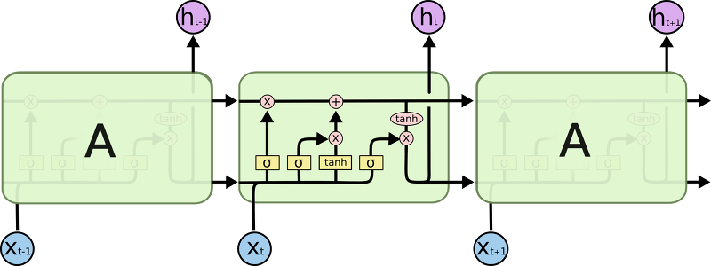

# 화장품 이름 생성기

- LSTM을 활용하여 화장품 이름을 생성하는 토이프로젝트를 진행하였습니다.
- 화해에 등록된 화장품 100,000여개의 카테고리 / 성분 / 이름을 Feature로 하여 학습을 진행하였습니다.
- 프레임워크는 Pytorch를 사용하였습니다.

## 학습방법

- LSTM을 설명하는 대표적인 이미지입니다.
- 간단하게 설명해서 아래의 X값에 t-1번째의 텍스트 토큰을 임베딩한 값과 카테고리 + 성분을 각각 원-핫 벡터로 만들어서 집어넣었고 해당 값을 기반으로 t번째의 텍스트 토큰을 예측하는 방식으로 학습하였다고 보시면 됩니다.
- 토크나이징은 한 글자 단위로 split하여 사용하였습니다.

## 결과물

> **생성된 스킨케어 카테고리 제품명**
>
> - 홀리데이 리얼 스킨 리커버리 세럼
> - 힐링 네이처 페이셜 스킨 토너
> - 허브 오프 에센스
>
> **생성된 메이크업 카테고리 제품명**
>
> - 산소비피 페이스 앤 바이탈라이징 스킨 스파이스
> - 블레미쉬 컨트롤 파운데이션
> - 데이 바이 데이 스킨 일루미네이팅 파우더 파운데이션

- 결과물은 아래와 같이 실제로 구분하기 어려울 정도로 괜찮은 이름들이 생성되었습니다.
- 실제 사용해보고 싶다면 [이곳](http://52.79.47.238:3333)을 방문해주세요 (언제닫힐지는 모릅니다 ㅎ)

## 한계점

- 과연 토이프로젝트답게 깊이 살펴보지는 못하였지만, 성분의 종류가 너무 많아 '이름', 정확하게는 각 토큰을 예측하는데 큰 영향도가 없어 보입니다.

- 처음에는 아무 생각없이 첫글자를 인풋으로 넣는 식으로 설계하여 진행했는데, 막상 결과물을 보니 첫글자를 어떤 식으로든 지정해주었어야 했고, 이것이 생각보다 주관적 요소가 반영되는 것 같아 별로라는 생각이 들었습니다. 위의 링크에서 생성되는 화장품명은 첫글자를 랜덤으로 선택하게끔 설정하였습니다.

- 실제 화장품명과 섞어서 객관식 퀴즈를 만들어 사람들에게 테스트해보고 싶었는데, 우선은 그 마음만 간직(?)하겠습니다.
